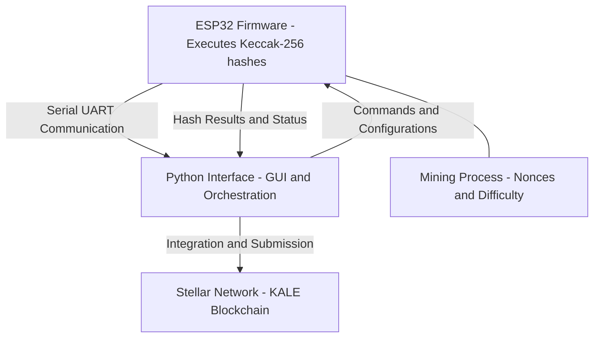
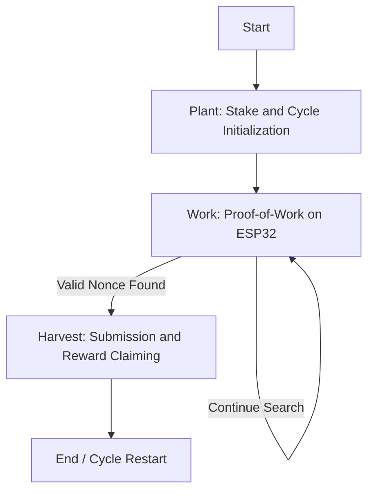
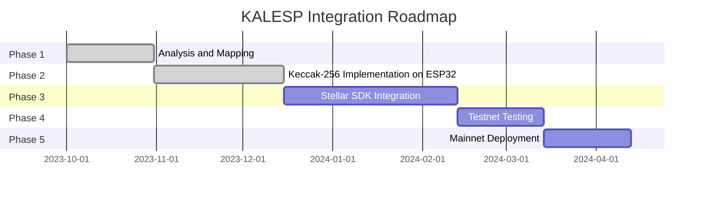

# KALESP - ESP32 Mining Development Platform

🚀 **KALESP** is a development platform for mining using ESP32 with Python interface for serial communication. This project serves as a foundation for future integrations with the KALE blockchain ecosystem.

<div align="center">
  
</div>


## THE (new) LORE

<div align="center">
  <a href="https://www.youtube.com/watch?v=j8e82qtdECU" target="_blank">
    
  </a>
  <br>
  <strong>🎥 <a href="https://www.youtube.com/watch?v=j8e82qtdECU" target="_blank">Watch the KALESP demo video</a></strong>
</div>


## 📊 System Architecture Overview



## 🔄 Mining Workflow (Plant → Work → Harvest)



## 📅 Development Roadmap




## What does it do?

KALESP is a mining development platform using ESP32 that implements hash algorithms (Keccak-256) and enables serial communication with a Python interface. Currently, the project already has:

- [x] Rust firmware for ESP32
- [x] Python GUI for control and monitoring
- [x] Bidirectional serial communication between ESP32 and Python
- [x] Difficulty and entropy configuration for mining
- [x] Real-time hashrate and status monitoring
- [x] ESP32 executes Keccak-256 mining equivalent to existing miners
- [ ] Python orchestrates plant → work → harvest
- [ ] Integrate Python to Transactions submitted via Launchtube successfully

## How does it work?

The project uses a distributed architecture:

1. **ESP32 (Rust Firmware)**: Executes hash algorithms (Keccak-256) and processes commands via UART
2. **Python Interface**: Provides a modern GUI with Flet, manages serial communication and displays real-time metrics
3. **Serial Communication**: Structured message protocol for command and data exchange between ESP32 and host

The system allows configuring parameters like difficulty (prefixed zeros) and entropy, executing the mining process directly on the ESP32.

## Why is it relevant?

This project is relevant because:

- It demonstrates the feasibility of mining on low-power devices like ESP32
- Serves as a foundation for integration with the KALE blockchain ecosystem on the Stellar network
- Enables experimentation with hash algorithms and proof-of-work on embedded hardware
- Offers an educational platform for understanding mining and blockchain
- Explores the potential of IoT devices as distributed mining nodes

## What else needs to be built?

Yes, for complete integration with kale-farmer and real KALE mining, we still need:

- Integration with Stellar SDK via Python host
- Automatic orchestration of plant → work → harvest cycle
- Real-time block monitoring
- Automatic proof-of-work submission to blockchain
- Rewards and stakes management
- Implementation of security features (private keys, secure communication)
- Testing in Testnet environment and Mainnet deployment
- Performance optimization to achieve ~100 KH/s

## See my Lore -> [click](./LORE.md)

## 📋 Overview

The project consists of two main components:

### 🔧 **ESP32 Firmware (Rust)**

- Implementation of hash algorithms (Keccak-256)
- Optimized serial communication
- Mining and configuration commands
- Support for different difficulty levels

### 🖥️ **Python Interface**

- **Modern GUI** with Flet for visual control
- **Robust serial communication** with ESP32
- **Real-time monitoring** of hashrate and status
- **Available commands**: help, info, reset, mine, zeros, entropy, hash

## 🎯 Current Features

- ✅ Bidirectional serial communication ESP32 ↔ Python
- ✅ Intuitive terminal-style graphical interface
- ✅ Keccak-256 hash algorithms
- ✅ Difficulty configuration (prefixed zeros)
- ✅ Real-time performance monitoring
- ✅ Structured logging system
- ✅ Auto-detection of serial ports

## 🛠️ Prerequisites

### Operating System

- macOS, Linux or Windows
- Python 3.8+ installed
- Rust installed via [rustup](https://rustup.rs/)

### Hardware

- **ESP32 DevKit** (any variant)
- **USB Cable** for connection
- **Serial port** available

## 🚀 Installation

### 1. ESP32 Environment Setup

#### Install ESP32 tools

```bash
# Install espup (ESP32 toolchain manager)
cargo install espup
espup install

# Configure environment variables
source $HOME/export-esp.sh
```

#### Install espflash for firmware upload

```bash
cargo install espflash
```

### 2. Python Environment Setup

```bash
# Navigate to project directory
cd /path/to/kalesp

# Install Python dependencies
cd interface
pip install -r requirements.txt
```

### 3. Compile and Upload Firmware

```bash
# Navigate to ESP32 directory
cd esp

# Compile firmware
cargo build --release

# Upload to ESP32 (replace /dev/ttyUSB0 with your port)
espflash flash --monitor target/xtensa-esp32-espidf/release/kalesp
```

## 🎮 How to Use

### Graphical Interface (Recommended)

1. **Start the GUI**:

```bash
cd interface
python esp32_gui.py
```

2. **Connect to ESP32**:

   - Select the serial port from dropdown
   - Click "Connect"
   - Wait for connection confirmation

3. **Available Commands**:
   - **Help**: Shows list of available commands
   - **Info**: Displays device information
   - **Reset**: Restarts the ESP32
   - **Mine**: Starts mining process
   - **Zeros**: Sets difficulty (number of prefixed zeros)
   - **Entropy**: Sets entropy value for mining

### Command Line Interface

```bash
cd interface
python python_serial.py
```

## 📊 Monitoring

The graphical interface provides:

- **Connection status** in real-time
- **Command log** and responses
- **Device information** (firmware, UART, settings)
- **Mining status** (hashrate, nonces tested)
- **Current settings** (zeros, entropy)

## 🔧 ESP32 Commands

| Command         | Description         | Example            |
| --------------- | ------------------- | ------------------ |
| `help`          | Lists all commands  | `help`             |
| `info`          | System information  | `info`             |
| `reset`         | Restarts the device | `reset`            |
| `mine`          | Starts mining       | `mine`             |
| `zeros <n>`     | Sets difficulty     | `zeros 4`          |
| `entropy <hex>` | Sets entropy        | `entropy deadbeef` |
| `hash <algo>`   | Selects algorithm   | `hash keccak256`   |

## 🚀 Roadmap - KALE Integration

### Roadmap for Real KALE Mining

- [x] Bidirectional serial communication implementation ESP32 ↔ Python
- [x] Intuitive graphical interface with Flet
- [x] Keccak-256 hash algorithms on ESP32
- [x] Difficulty configuration with prefixed zeros
- [x] Real-time hashrate and status monitoring
- [x] Automatic serial port detection
- [x] Basic commands (help, info, reset, mine, zeros, entropy, hash)
- [x] Phase 1: Analysis and Mapping
- [x] Phase 2: Keccak-256 Implementation on ESP32
- [ ] Phase 3: Stellar SDK Integration via Python host
- [ ] Automatic orchestration of Stellar transactions (plant → work → harvest)
- [ ] Real-time block monitoring
- [ ] Automatic proof-of-work submission
- [ ] Rewards and stakes management
- [ ] Security features (private keys on host, secure communication, retries)
- [ ] Complete distributed architecture
- [ ] Phase 4: Testnet Testing
- [ ] Phase 5: Mainnet Deployment
- [ ] Performance optimization (hashrate ~100 KH/s, latency <1s, uptime 24/7)

### 🎯 **Future Objective**

Integrate KALESP with the **KALE blockchain** ecosystem for real mining on the Stellar network:

### 📋 **Planned Features**

#### 🔗 **Integration with kale-farmer**

- **Automatic orchestration** of Stellar transactions (plant → work → harvest)
- **Real-time block monitoring**
- **Automatic proof-of-work submission**
- **Rewards and stakes management**

#### ⚡ **Real KALE Mining**

- **Keccak-256 algorithm** optimized for ESP32
- **Compatible data structure** (76 bytes: block_index + nonce + entropy + farmer_address)
- **Prefixed zeros validation** for difficulty
- **Stellar SDK integration** via Python host

#### 🏗️ **Distributed Architecture**

- **ESP32**: Keccak-256 mining execution
- **Python Host**: Stellar transaction orchestration
- **Stellar Network**: Submission via Launchtube
- **KALE Smart Contracts**: Validation and rewards

#### 🔐 **Security Features**

- **Private keys** only on Python host
- **Secure communication** ESP32 ↔ Host
- **Retry logic** for failed transactions
- **State backup** for recovery

### 📅 **Development Phases**

1. **Phase 1** - Analysis and Mapping _(Completed)_
2. **Phase 2** - Keccak-256 Implementation on ESP32 _(Completed)_
3. **Phase 3** - Stellar SDK Integration
4. **Phase 4** - Testnet Testing
5. **Phase 5** - Mainnet Deployment

### 🎯 **Performance Goals**

- **Target hashrate**: ~100 KH/s on ESP32
- **Latency**: <1s for work submission
- **Uptime**: 24/7 with auto-reconnection
- **Efficiency**: Energy consumption optimization

---

> 💡 **Note**: Current KALESP is a development version. Full integration with KALE blockchain is planned for future versions.

## 🤝 Contributing

Contributions are welcome! Please:

1. Fork the project
2. Create a feature branch (`git checkout -b feature/AmazingFeature`)
3. Commit your changes (`git commit -m 'Add some AmazingFeature'`)
4. Push to the branch (`git push origin feature/AmazingFeature`)
5. Open a Pull Request

## 📄 License

This project is licensed under the MIT License. See the `LICENSE` file for more details.

## 🔗 Related Links

- [KALE Smart Contracts](../KALE-sc/) - KALE smart contracts
- [kale-farmer](../kale-farmer/) - Rust reference miner
- [kale-miner](../kale-miner/) - Optimized GPU/CPU miner
- [Stellar Network](https://stellar.org/) - Stellar blockchain
- [Soroban](https://soroban.stellar.org/) - Smart contracts platform

---

**Project Status**: 🚧 Active Development  
**Current Version**: v0.1.0 - Development Prototype  
**Next Release**: v0.2.0 - Basic KALE Integration

---

> 💡 **Note**: The diagrams above show the current architecture and planned roadmap for complete integration with the KALE blockchain ecosystem.
